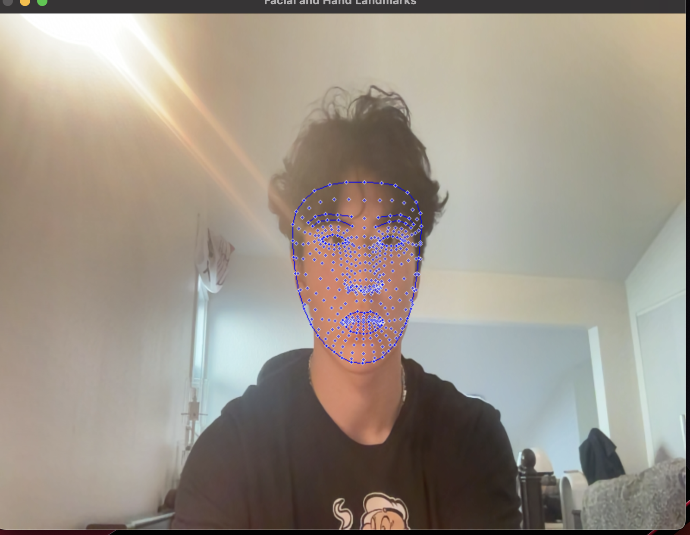
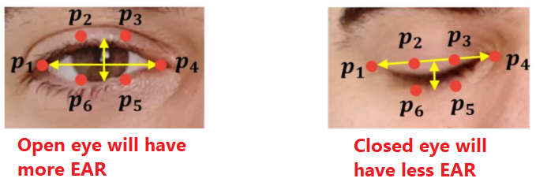

# ArtificialCaffeine

## Objective: 
### To analyze facial features and detect drowsiness based on the Eye Aspect Ratio (EAR). If the user is detected as drowsy for more than 5 seconds, an alarm is triggered to alert the user.

## Purpose (Why?): 
### During my first year of college, I often found myself feeling drowsy and falling asleep while studying on my computer. Despite consuming large amounts of caffeine, I would still doze off in my chair, ruining both my study time and sleep schedule. To solve this problem, I decided to create "artificial caffeine" to help keep myself awake and focused while working. (However, if you see yourself constantly triggering the alarm, it is probably time to get some sleep!)

## Libraries Used: 
### OpenCV: For video capture and image processing (resize window & convert BGR to RGB)
### Mediapipe: For facial landmark detection
### Playsound: For playing an alarm sound

## Video Demonstration:
### https://youtu.be/_PMdOrkzTwk

